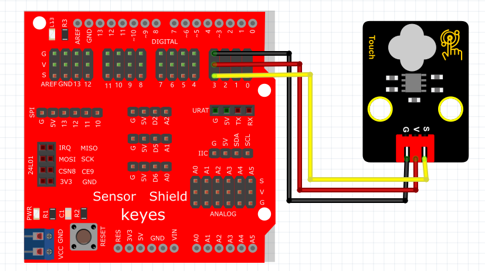

# Arduino


## 1. Arduino简介  

Arduino是一种开放源代码的电子原型平台，旨在为开发者提供易用且高效的工具，用于创建各种电子控制项目。Arduino平台由多种开发板（如Arduino UNO、Mega等）及丰富的传感器和执行器组件组成，能够支持多种编程语言，其中最常用的是基于C/C++的Arduino编程语言。Arduino使得初学者能够通过图形化编程环境（如Scratch、Mixly）或文本编程进行学习，非常适合教育、DIY项目以及快速原型设计。  

Arduino的特点包括：  
- **易于使用**：即便是没有编程经验的用户也可以通过丰富的库和示例快速上手。  
- **灵活性**：支持多种传感器和模块，使其适用于多种应用，包括智能家居、机器人和物联网等。  
- **广泛的社区支持**：用户可以通过网络访问大量的项目案例和编程教程，促进学习与分享。  

## 2. 连接图  

  

## 3. 测试代码  

```cpp  
int ledPin = 13; // 定义数字口13  
int inputPin = 3; // 定义数字口3  

void setup() {  
    pinMode(ledPin, OUTPUT); // 将ledPin设置为输出  
    pinMode(inputPin, INPUT); // 将inputPin设置为输入  
}  

void loop() {  
    int val = digitalRead(inputPin); // 读取数字口3的值并赋给val  
    if (val == HIGH) { // 当val为高电平时，LED亮起  
        digitalWrite(ledPin, HIGH); // LED亮起  
    } else {  
        digitalWrite(ledPin, LOW); // LED熄灭  
    }  
}  
```  

## 4. 测试结果  

按照上图接好线，烧录好代码；上电后，在按下按键后，模块灯亮起。  

## 5. 加强训练  

代码：  

```cpp  
int led = 13; // 定义LED引脚  
int inputPin = 3; // 定义输入引脚  
int x; // 定义变量x  

void setup() {  
    pinMode(led, OUTPUT); // 设置LED为输出  
    pinMode(inputPin, INPUT); // 设置inputPin为输入  
}  

void loop() {  
    int val = digitalRead(inputPin); // 读取inputPin的值  
    if (val == 1) { // 当val等于1时  
        x++; // 增加x  
        digitalWrite(led, HIGH); // LED亮起  
        delay(500); // 延迟500毫秒  
    }  
    if (x == 2) { // 当x等于2时  
        digitalWrite(led, LOW); // LED熄灭  
        x = 0; // 重置x  
        delay(500); // 延迟500毫秒  
    }  
}  
```  

结果  

上传代码后，触摸一下时LED灯亮起，再触摸一下时LED灯熄灭。实现这个功能的关键在于变量x，值得思考深化。  

## 6. 应用  

1. 广泛的数码产品——MP3、MP4、LCD-TV、音响面板等。  
2. 家用电器——电视机、电风扇、微波炉、电烤箱、消毒柜等控制面板。  
3. 工业用产品——投影机、工业电脑、仪器仪表等控制面板。  
4. 安防产品——智能门禁系统控制面板。  

此外，还涉及到手持设备、工业控制、汽车电子和军用产品等，能够取代传统的按钮操作面板。


