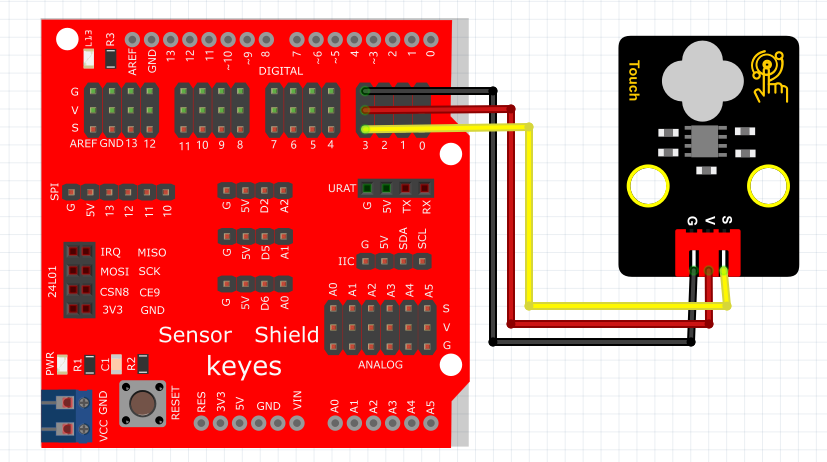
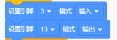
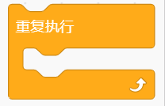
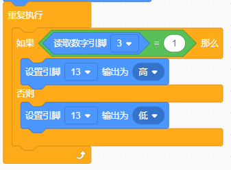
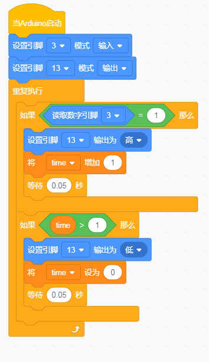

# KidsBlock

## 1. KidsBlock简介  

KidsBlock是一款图形化编程工具，旨在通过简化编程过程使初学者能够轻松上手。该工具特别适合儿童和青少年，通过拖拽模块来创建程序，帮助他们理解编程逻辑和控制实现。KidsBlock特别支持Arduino开发板，使用户可以在真实的电子项目中运用所学知识。用户可以通过图形化界面设计程序，而无需深入学习复杂的编程语言，降低了入门门槛。  

KidsBlock拥有丰富的库和示例项目，让孩子们能够在玩乐中学习，培养他们的逻辑思维和问题解决能力。它能够与多种传感器和模块兼容，使得学习编程的过程既有趣又富有挑战性。  

## 2. 连接图  

  

## 3. 测试代码  

1. 在事件栏拖出Arduino启动模块。  

     

2. 在引脚栏拖出两个设置引脚模式模块，一个设置为引脚3输入，另一个设置为引脚13输出。  

     

3. 在控制栏拖出重复执行模块。  

     

4. 在控制栏拖出判断模块，并在判断模块中添加运算的等于模块，将等于模块的左边添加读取数字引脚3模块，右边设置为1；当满足条件时，第13引脚输出高电平，否则输出低电平。  

     

## 4. 测试结果  

按照上图接好线，烧录好代码；上电后，按下按键，LED模块灯亮起。  

## 5. 加强训练  

代码：

结果  

上传代码后，触摸一下时LED灯亮起，再触摸一下时LED灯熄灭。实现这个功能的关键在于变量time，值得进一步思考。  

## 6. 应用  

1. 广泛的数码产品——MP3、MP4、LCD-TV、音响等面板。  
2. 家用电器——电视机、电风扇、微波炉、电烤箱、消毒柜等控制面板。  
3. 工业用产品——投影机、工业电脑、仪器仪表等控制面板。  
4. 安防产品——智能门禁系统控制面板。  

此外，还适用于手持设备、工业控制、汽车电子、军用产品以及其他涉及控制按键操作面板的产品，以取代传统按钮键。

