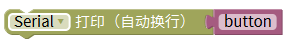
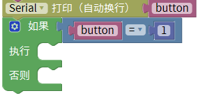
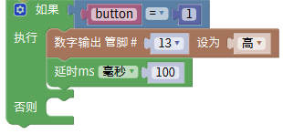
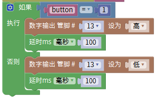
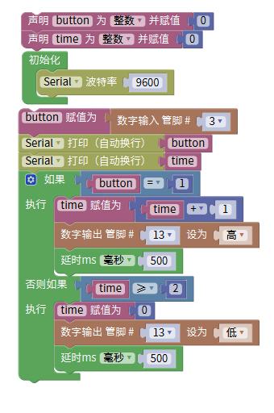

# Mixly

## 1. Mixly简介  

Mixly是一款图形化编程环境，旨在为初学者提供一个简单易用的工具，使他们能够学习和应用编程知识。基于Scratch编程语言，Mixly允许用户通过拖拽不同的模块来创建程序，特别适合儿童和青少年使用。它支持多种硬件平台，包括Arduino，让用户能够通过可视化互动的方式进行编程。  

Mixly不仅为编程初学者提供了直观的学习体验，还包括丰富的项目示例和教程，帮助用户在实践中加深对编程逻辑和电子知识的理解。通过与传感器及执行器等硬件的结合，用户能够轻松构建实际应用，培养他们的创造力和解决问题的能力。  

## 2. 连接图  

  

## 3. 测试代码  

1. 在变量栏找到声明全局变量模块，将item变量名改为“button”，设置button初始变量为整数并赋值为0。  

     

2. 初始化设置波特率为9600，表示串口通信的速度。  

     

3. 在变量栏拖出button赋值模块，再在输入/输出栏拖出数字引脚输入模块，设置引脚为3。  

     

4. 找到并拖出串口栏下的打印并自动换行模块，将定义的变量button放在打印模块后面。  

     

5. 在控制栏拖出判断模块并点击设置图案，增加一个“否则”的选项。  

     

6. 在逻辑栏拖出一个等于模块，添加变量button和数字1的比较。  

     

7. 在输入/输出栏拖出设置引脚模块，设置引脚为13并输出高电平，然后在控制栏拖出一个延时模块，延时为100ms。  

     

8. 再次拖出设置引脚模块，将引脚设为13的低电平，最后拖出一个延时模块，延时为100ms。  

     

## 4. 测试结果  

按照上图接好线，烧录好代码；上电后，触摸感应器，LED模块灯亮起。  

## 5. 加强训练  

代码：

结果

上传代码后，触摸一次时LED灯亮起，再触摸一次时LED灯熄灭。实现这个功能的关键在于变量X，值得深入思考。  

## 6. 应用  

1. 广泛的数码产品——MP3、MP4、LCD-TV、音响等面板。  
2. 家用电器——电视机、电风扇、微波炉、电烤箱、消毒柜等控制面板。  
3. 工业用产品——投影机、工业电脑、仪器仪表等控制面板。  
4. 安防产品——智能门禁系统的控制面板。  

此外，涉及手持设备、工业控制、汽车电子和军用产品等多个领域，能够取代传统的按键操作面板。

