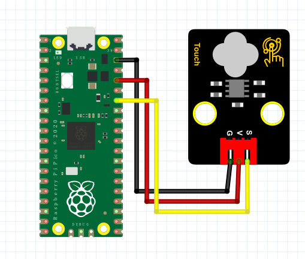

# Python


## 1. Python简介  

Python是一种广泛使用的高级编程语言，以其简洁和清晰的语法而闻名。由Guido van Rossum于1991年推出，Python支持多种编程范式，包括面向对象、过程式和函数式编程。它具有丰富的标准库和一个活跃的社区，使得用户能够快速访问大量的资源和工具。Python被广泛用于各种应用程序，从网站开发到数据分析，深度学习和人工智能等领域。  

Python的优点包括：  
- **易读性**：Python的语法简洁，易于学习和使用，适合初学者。  
- **跨平台**：Python可以在多种平台上运行，包括Windows、macOS和Linux。  
- **广泛的应用**：Python适用于后端开发、数据科学、人工智能等多个领域。  
- **丰富的库支持**：Python有许多强大的第三方库，例如NumPy、Pandas、TensorFlow等，支持各种功能扩展。  

## 2. 连接图  

  

## 3. 测试代码  

```python  
import machine  
import utime  

key = machine.Pin(28, machine.Pin.IN)  # 设置28脚为输入  
led = machine.Pin(25, machine.Pin.OUT)  # 设置25脚为输出  

while True:  
    if key.value() == 1:  # 判断输入是否为高电平  
        led.value(1)  # LED灯亮  
    else:  # 否则  
        led.value(0)  # LED灯灭  
```  

## 4. 测试结果  

按照上图接好线，烧录好代码；上电后，触摸按键，LED模块灯亮起。  

## 5. 加强训练  

代码：  

```python  
import machine  
import utime  

key = machine.Pin(28, machine.Pin.IN)  # 设置28脚为输入  
led = machine.Pin(25, machine.Pin.OUT)  # 设置25脚为输出  
val = 0  # 初始化val变量  

while True:  
    if key.value() == 1:  # 判断按键是否被触摸  
        val += 1  # 计数加1  
        led.value(1)  # LED灯亮  
        utime.sleep_ms(300)  # 延时300ms  

    if val == 2:  # 当触摸次数达到2次时  
        led.value(0)  # LED灯熄灭  
        val = 0  # 重置计数  
        utime.sleep_ms(300)  # 延时300ms  
```  

结果  

上传代码后，触摸一次时LED灯亮起，再触摸一次时LED灯熄灭。实现这个功能的关键在于变量val，值得深入思考。


